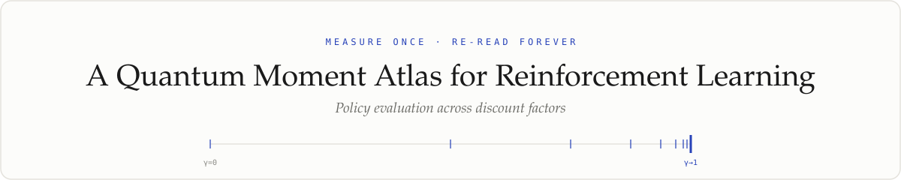
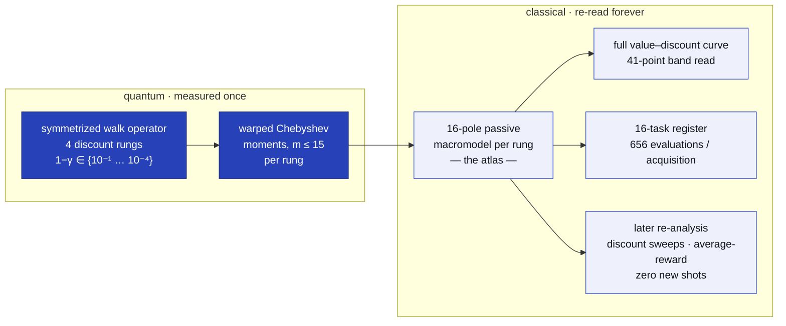
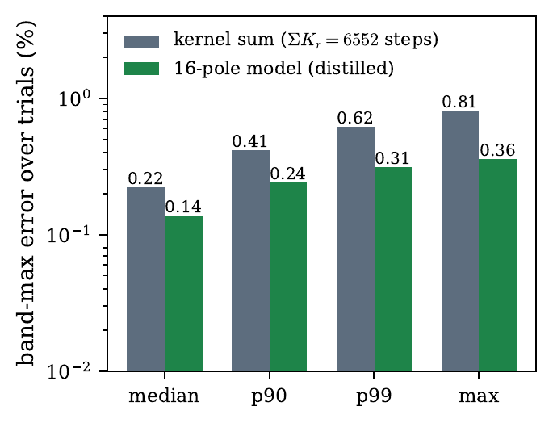
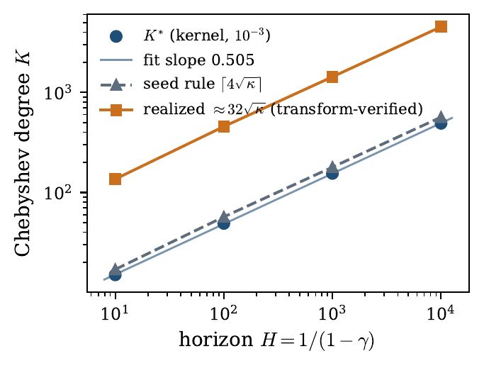
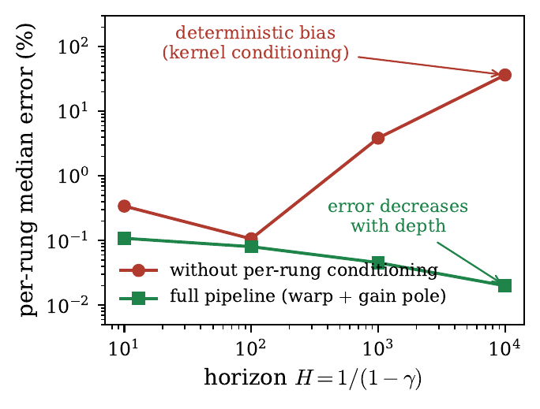
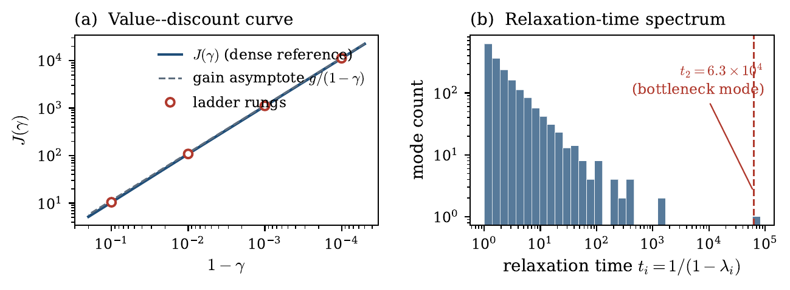
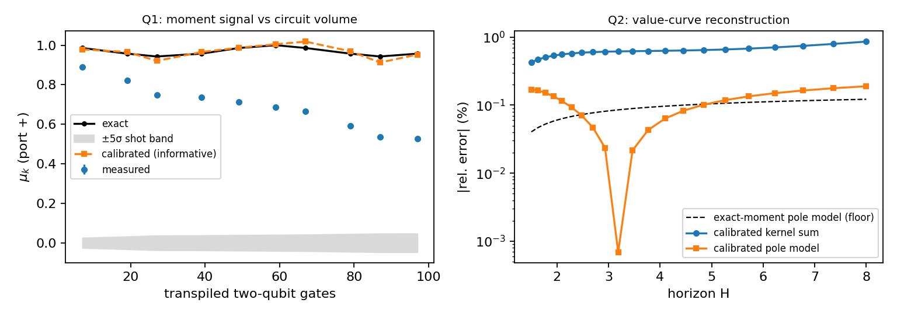

<div align="center">

<picture>
  <source media="(prefers-color-scheme: dark)" srcset="docs/assets/banner_dark.svg">
  
</picture>

**Kamran Ansari** · Stanford University · ansarik@stanford.edu

<a href="paper/amortized_qpe_v2.9.pdf"></a>

<a href="#reproduce-it"></a>
<a href="hardware/"></a>
<a href="https://kansari123.github.io/A-Quantum-Moment-Atlas-for-Reinforcement-Learning/"></a>


<em>In RL, policy evaluation is a curve, not a number. Existing quantum approaches pay a fresh full-depth circuit per query — each discount, each task, each re-analysis. Here, one fixed set of walk-operator measurements is post-processed classically into a reusable model, the <b>atlas</b>, that serves the entire value–discount curve, every reweighting of a 16-task register, and any later re-analysis at no additional quantum cost.</em>

<sub>arXiv link pending — badges and the citation block will be updated when the preprint is live.</sub>

</div>

## TL;DR

- **One measurement set, four decades of horizon.** The atlas reconstructs the value–discount band at **0.044 %** noiseless, **0.0037 %** on a 16-task register, and **0.14 %** median under per-moment noise — with error *decreasing* in horizon depth.
- **410× compression at negative accuracy cost.** The distilled 16-pole model is *more* accurate than the 6,552-step estimator it compresses.
- **A measured √H law.** Minimal kernel degree scales as **K\* ∝ H^0.505**, matching the √H Bernstein count.
- **Hardware-validated estimator layer.** On `ibm_fez`, a shallow instance performs genuine spectroscopy: value curve to **0.19 %** (calibrated, validation-only) at the 0.12 % truncation floor.

> [!IMPORTANT]
> **Read the scope before the numbers.** The advantage-bearing experiments are classically simulated — the hardware study validates the measurement-and-estimation layer at two to four states only. Sign-free reversible structure caps the speedup at quadratic. And at the study's *measured* realization constant (c = 32) the atlas **loses** to classical trajectory estimates by ≈7× on total steps; break-even is ≈76 register acquisitions at that constant, versus under twenty curve sweeps at the seed constant c = 4. The crossover analysis, in both directions, is one of the paper's results — not a footnote.

## How it works

Quantum measurements happen **once**, on a logarithmic ladder of discount rungs. Everything downstream — the model fit and every read of it — is classical, so new questions cost zero new shots.



## Headline results

<table>
<tr>
<td width="50%"></td>
<td width="50%">

**Distillation beats the estimator it distills.** Under identical per-trial noise, the 16-pole model (median **0.138 %**) is *more* accurate than the 6,552-step Chebyshev kernel-sum estimator (median **0.222 %**, p₉₀ 0.415 %) whose moments it consumed. Compression here is not a lossy afterthought — it is where the accuracy comes from.

</td>
</tr>
<tr>
<td width="50%"></td>
<td width="50%">

**The √H compression law, measured.** K\* = {15, 49, 155, 491} across H = {10, 10², 10³, 10⁴} — least-squares slope **0.505**, matching the √H Bernstein count. Also shown: the seed rule ⌈4√κ⌉ and the transform-verified realization K ≈ 32√κ for the full m ≤ 15 warped-moment set.

</td>
</tr>
<tr>
<td width="50%"></td>
<td width="50%">

**Every design element is necessary.** Each ablation fails with a distinct, diagnosable signature: drop positivity and fits explode by *seven orders of magnitude* even at exact moments; unbalance the ports and you get a 10⁴ error amplifier; drop the Möbius warp and a deterministic deep-rung bias climbs to **36 %**. With the full pipeline the trend *inverts* — the deepest horizon is the most accurate.

</td>
</tr>
</table>

## The measured object



<sub>The testbed is a 3600-state reversible chain (60×60 lognormal-weighted grid, 10⁻³ bottleneck) built so the band is genuinely hard: **(a)** J(γ) across four decades with the ladder rungs and the gain asymptote g/(1−γ), g = 1.141; **(b)** a relaxation spectrum spanning three decades with one slow inter-half mode at t₂ = 6.3×10⁴ — every rung probes different dynamics.</sub>

## Hardware: two runs on `ibm_fez`



- **Run 1 (deep circuits)** locates the device's decoherence wall near **500 routed two-qubit gates** and validates the noise model's variance at shot level.
- **Run 2 (shallow two-state instance)** performs genuine spectroscopy — **all ten moment orders informative** — reconstructing its value curve to **14 %** blind and, under a truth-referenced two-parameter noise calibration (validation-only), to **0.19 %**, at the **0.12 %** truncation floor.
- The notebook's acquisition cells require IBM Quantum access; **every analysis cell re-runs from the cached run JSONs** in [`hardware/`](hardware/) with no QPU access.

## Reproduce it

Requires Python 3 with `numpy`, `scipy`, `matplotlib`. Scripts read and write in the working directory. This exact pattern was verified end-to-end in a fresh environment: all randomness is pinned (`default_rng(7)` edge weights and reward, `99` task corners, `12345` noise trials), and **each regenerated results file was checked byte-identical** against its archived copy in [`evidence/`](evidence/).

```bash
mkdir work && cd work
cp ../code/*.py .
python3 qrl_testbed.py   # → results_qrl1.json   (~2–4 min)
python3 qrl_repair.py    # → results_qrl1c.json  (~2–4 min)
python3 qrl_warp.py      # → results_qrl1d.json  (~3–6 min)
python3 make_figs.py     # → the four paper figures (self-checks t₂ = 6.3039e4, g = 1.141)
```

> [!NOTE]
> Several printed lines report **registered ablation arms whose designed outcome is failure** (positivity removed, ports unbalanced, …). That is the paper's ablation table being regenerated — not a reproduction error.

## What's in the box

| Path | Contents |
|---|---|
| [`code/`](code/) | The three campaign scripts sharing a verbatim testbed constructor — `qrl_testbed.py` (validation checks, compression law, signed/raw-port ablations), `qrl_repair.py` (the balanced, unconditioned arm), `qrl_warp.py` (the full pipeline) — plus `make_figs.py`. |
| [`evidence/`](evidence/) | Registration with accuracy criteria **fixed prior to data collection**, the outcome ledger, labeled amendments and repair addenda, and the archived machine-readable results `results_qrl1{,c,d}.json`. |
| [`hardware/`](hardware/) | IBM diagnostics notebook (blank + executed), both `ibm_fez` runs' raw JSONs, and run-1/run-2 reanalysis artifacts (JSON + PNG). |
| [`paper/`](paper/) | Paper source, compiled PDF, and the four figures. |
| [`docs/`](docs/) | Landing page source and README assets. |

<details>
<summary><b>File conventions in <code>evidence/</code></b></summary>
<br>

- `REGISTRATION_*` — protocol and quantitative accuracy criteria, fixed prior to data collection
- `LEDGER_*` — outcome ledgers
- `AMENDMENT_*` / `ADDENDUM_*` — labeled post-registration changes and declared repair rounds
- `results_*.json` — machine-readable results

</details>

## Cite

Until the arXiv identifier is live:

```bibtex
@misc{ansari2026momentatlasrl,
  title  = {A Quantum Moment Atlas for Reinforcement Learning:
            Policy Evaluation Across Discount Factors},
  author = {Ansari, Kamran},
  year   = {2026},
  note   = {arXiv preprint; identifier to be added}
}
```

## Related

[**Quantum Spectral Atlas for Infinitely Large Graphs**](https://github.com/kansari123/Quantum-Spectral-Atlas-for-Infinitely-Large-Graphs) — the same qubitized-walk moment protocol pointed at spectral densities of graph limits.

---

<div align="center"><sub><a href="https://kansari123.github.io/A-Quantum-Moment-Atlas-for-Reinforcement-Learning/">Landing page</a> · Kamran Ansari, Stanford University</sub></div>
